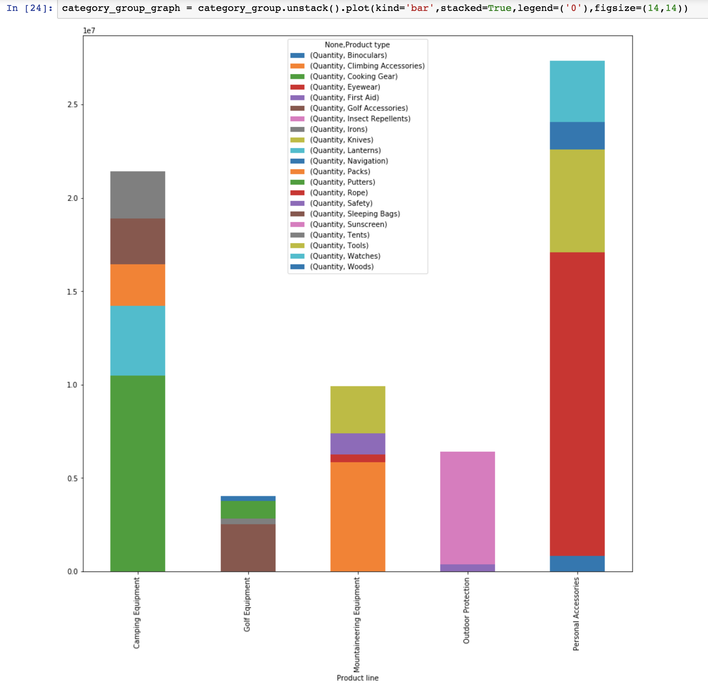
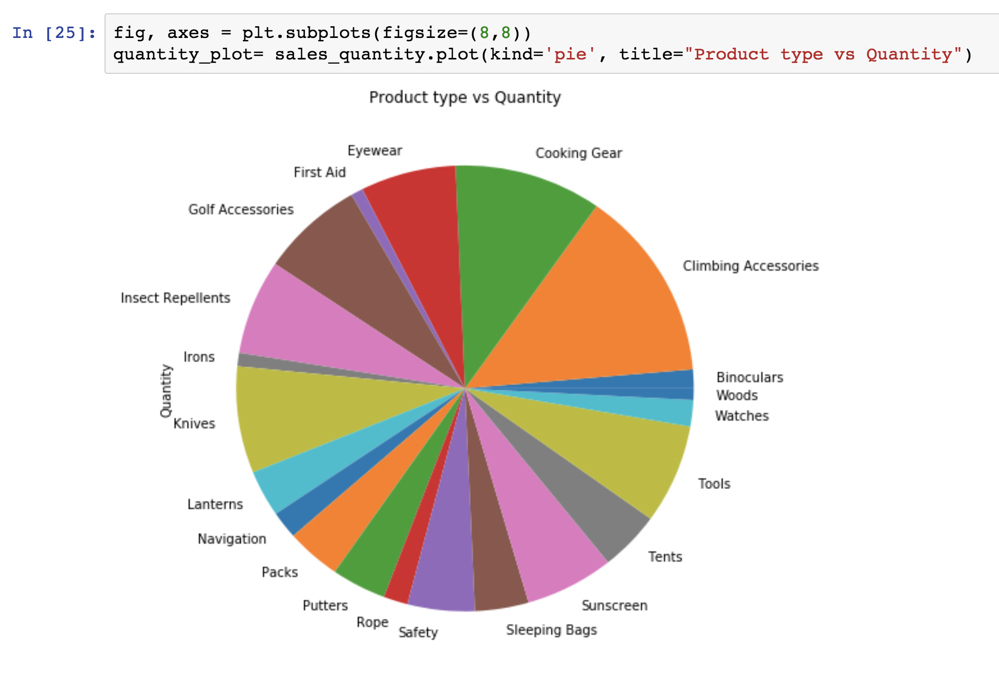

# sales_data_analysis_visualization
Data analysis &amp; visualization sales dataset with Python using Matplotlib, Pandas. 

### Dataset source: 
https://www.ibm.com/communities/analytics/watson-analytics-blog/sales-products-sample-data/

# Objective:
* Read dataset from csv file and generate pandas dataframes.
* Get information about the dataset using describe() & info().
* Check how much 'Revenue' is being generated by each product.
* Use groupby() to display all products. Also display sum of their revenue.
* Generate a bar graph of 'Product line' & mean of the 'Revenue'.
* Generate a bar graph of 'Product type' & mean of the 'Quantity'.
* Display the sales break down by category.
* Finally bar and pie graph of 'Product line','Product type', 'Quantity'.

# Steps To Run:
For this demonstration, I am using the Jupyter Notebook, open-source web application that allows you to create and share documents that contain live code, equations, visualizations and narrative text.

### Step 1:
Create a virtual enviroment and install dependencies by running requirements.txt.

$ pip install virtualenv env

$ source env/bin/activate

$ pip install -r requirements.txt

### Step 2:
Run the script.

$ jupyter notebook

### Bar graph of 'Product line','Product type', 'Quantity'.

### Pie graph of 'Product line','Product type', 'Quantity'.

